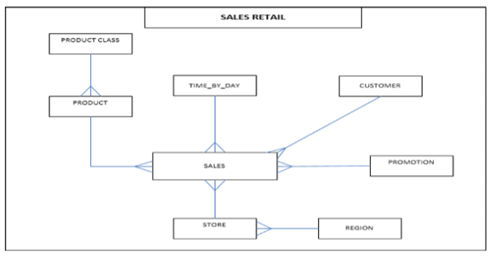

# Retail-Case-Study
This is a training exercise for a training class that uses PySpark, AWS S3, Airflow and Snowflake

##Objective
In this project, we will be migrating the existing Retail project to use the New Architecture using Spark, Airflow and Kafka.

##Retail Schema

###Foodmart DB for MySQL can be downloaded from the below link: 

[Foodmart DB](http://pentaho.dlpage.phi-integration.com/mondrian/mysql-foodmart-database)
[Foodmart Schema](http://www2.dc.ufscar.br/~gbd/download/files/courses/DW&OLAP_2009/foodmart.jpg)

##Assignment: 
1. Find total Promotion sales generated on weekdays and weekends for each region, year & month 
2. Find the most popular promotion which generated highest sales in each region 

Steps Involved: 
1. Create pySpark scripts for initial and incremental loads. The script will read sales and promotion tables based on last_update_date column from mysql and store them in AVRO format in S3 buckets. You might want to add a last_update_date in the tables

2. A second pySpark script will read the AVRO files, filter out all non-promotion records from input, join the promotion and sales tables and save the data in Parquet format in S3 buckets.
 
3. The Parquet file is aggregated by regionID, promotionID, sales_year, sales_month to generate total StoreSales for weekdays and weekends and the output is saved as a CSV file in S3 buckets.

4. The CSV file generated is loaded into a Snowflake database.

5. Following queries are executed on Snowflake table 
   * Query1: List the total weekday sales & weekend sales for each promotions: 
	Region ID, Promotion ID, Promotion Cost, total weekday sales, total weekend sales 
   * Query 2: List promotions, which generated highest total sales (weekday + weekend) in each region. 
    Following columns are required in output: 
    Region ID, Promotion ID, Promotion Cost, total sales 

6. Automate the workflow using Airflow scheduler

Additional Assignment:
1. Modify the spark code in step 1. to write the result to Kafka topics called “RetailSales” and “PromoData”
2. Write a Spark Kafka Consumer which will subscribe to above topics and write the output in AVRO format in S3 buckets.